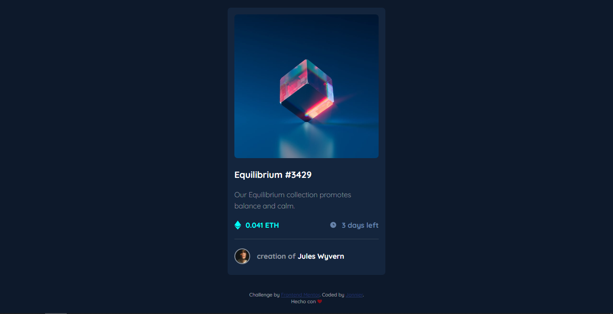

# Frontend Mentor - QR code component solution

This is a solution to the [NFT preview card component challenge on Frontend Mentor](https://www.frontendmentor.io/challenges/nft-preview-card-component-SbdUL_w0U). 

## Table of contents

- [Overview](#overview)
  - [Screenshot](#screenshot)
  - [Links](#links)
- [My process](#my-process)
  - [Built with](#built-with)
- [Author](#author)

## Overview

### Screenshot

### Links

- Solution URL: [Add solution URL here](https://github.com/jonniermartinez/NFT-card)
- Live Site URL: [Add live site URL here](https://jonniermartinez.github.io/NFT-card/)

## My process

### Built with

- Semantic HTML5 markup
- CSS custom properties

## Author

- Twitter - [@JonnierMartinez](https://twitter.com/JonnierMartinez)